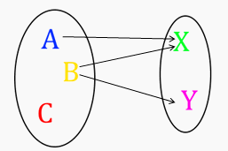

[↩️ صفحه اصلی](/README.md)
# 🖥️ ریاضیات گسسته

## 📊 اطلاعات کلی درس
| کد درس | واحد | نوع درس | هم‌نیاز |
|:------:|:----:|:-------:|:--------:|
| 777786 |  3   |  اصلی   |    [مبانی کامپیوتر و برنامه سازی](/%D9%86%DB%8C%D9%85%D8%B3%D8%A7%D9%84%201/%D9%85%D8%A8%D8%A7%D9%86%DB%8C%20%DA%A9%D8%A7%D9%85%D9%BE%DB%8C%D9%88%D8%AA%D8%B1%20%D9%88%20%D8%A8%D8%B1%D9%86%D8%A7%D9%85%D9%87%20%D8%B3%D8%A7%D8%B2%DB%8C/README.md)، ریاضی1     |

## 🎯 اهداف درس
درس ریاضیات گسسته به مفاهیمی مانند مجموعه‌ها، گراف‌ها، توابع، و الگوریتم‌ها می‌پردازد. هدف اصلی آن، ارائه ابزارهای ریاضی برای حل مسائل منطقی و ساختاری است. این درس در طراحی الگوریتم‌ها، ساختمان داده‌ها، منطق و نظریه گراف‌ها کاربرد دارد و به مدل‌سازی و حل مسائل بهینه‌سازی کمک می‌کند.

## 📚 منابع اصلی درس
1. **Discrete Mathematics and Its Applications** (7th Edition)
   - نویسنده: Kenneth Rosen 
   - [لینک دانلود کتاب](منابع/rosen_discrete_mathematics_and_its_applications_7th_edition.pdf)

## 📅 سیلابس معمول

    <table border="1">
        <thead style="text-align: center;">
            <tr>
                <th>موضوع</th>
            </tr>
        </thead>
        <tbody>
            <tr>
                <td>دنباله‌ها، توابع، مجموعه ها و ماتریس‌ها</td>
            </tr>
            <tr>
                <td>نظریه اعداد و رمزنگاری</td>
            </tr>
            <tr>
                <td>استقرا و مسائل بازگشتی</td>
            </tr>
            <tr>
                <td>شمارش</td>
            </tr>
            <tr>
                <td>احتمال</td>
            </tr>
            <tr>
                <td>گراف</td>
            </tr>
        </tbody>
    </table>

<!-- ## 🔗 منابع مفید دیگر
-  -  -->

<!-- ## 💡 نکات مهم
 -->

---
 موفق باشید! 🚀