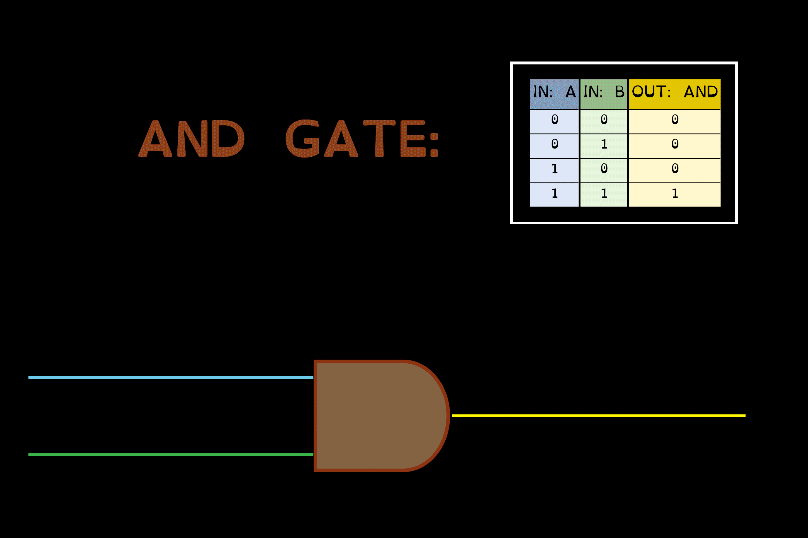

[↩️ صفحه اصلی](/README.md)

# 🔢 مدار منطقی

## 📊 اطلاعات کلی درس

    <table border="1">
        <thead>
            <tr>
                <th>کد درس</th>
                <th>واحد</th>
                <th>نوع درس</th>
                <th>هم نیاز</th>
            </tr>
        </thead>
        <tbody>
            <tr>
                <td>7777130</td>
                <td>3</td>
                <td>اصلی</td>
                <td>ریاضیات گسسته</td>
            </tr>
        </tbody>
    </table>

# 

**تمامی موارد زیر بر اساس تدریس دکتر رشتی در ترم 14011 است.**

## 🎯 اهداف درس
در این درس شما با مفاهیم سخت‌افزار دیجیتال و مدارهای منطقی آشنا خواهید شد. این درس به بررسی مدارهای ترکیبی و ترتیبی، نمایش اعداد، و مدارهای محاسباتی می‌پردازد. همچنین بخشی از درس شامل پروژه‌های عملی با زبان‌های توصیف سخت‌افزار مانند Verilog  است.

## 📚 منابع درس

- **S. Brown, Z. Vranesic. Fundamentals of Digital Logic with Verilog Design, 3rd Edition. McGrawHill, 2014.**  
  - **یا ویرایش چهارم 2022 که شامل طراحی با VHDL نیز می‌شود.**  
  - ترجمه فارسی ویرایش سوم توسط زارع پور، انتشارات نص، 1394.
  
- [لینک منبع](https://github.com/CE-SCU/scu-computer-engineering-courses/tree/main/%D9%86%D9%8A%D9%85%D8%B3%D8%A7%D9%84%203/%D9%85%D8%AF%D8%A7%D8%B1%D9%87%D8%A7%DB%8C%20%D9%85%D9%86%D8%B7%D9%82%DB%8C/%D9%85%D9%86%D8%A7%D8%A8%D8%B9)

## 📅 سیلابس درس

    <table border="1">
        <thead>
            <tr>
                <th>هفته</th>
                <th>تاریخ</th>
                <th>مباحث پوشش داده شده</th>
                <th>توضیحات</th>
            </tr>
        </thead>
        <tbody>
            <tr>
                <td>1</td>
                <td>19/6</td>
                <td>فصل 1 و فصل 2 تا بخش 7-2</td>
                <td></td>
            </tr>
            <tr>
                <td>2</td>
                <td>26/6</td>
                <td>فصل 2 تا بخش 11-2 + Verilog/VHDL</td>
                <td></td>
            </tr>
            <tr>
                <td>3</td>
                <td>2/7</td>
                <td>فصل 2 تا بخش 15-2</td>
                <td></td>
            </tr>
            <tr>
                <td>4</td>
                <td>9/7</td>
                <td>فصل 3 تا بخش 3-3</td>
                <td></td>
            </tr>
            <tr>
                <td>5</td>
                <td>16/7</td>
                <td>فصل 3 تا بخش 5-3 + Verilog/VHDL</td>
                <td></td>
            </tr>
            <tr>
                <td>6</td>
                <td>23/7</td>
                <td>فصل 3 تا بخش 7-3 و فصل 4 تا بخش 1-4</td>
                <td></td>
            </tr>
            <tr>
                <td>7</td>
                <td>30/7</td>
                <td>فصل 4 تا بخش 6-4 + Verilog/VHDL</td>
                <td></td>
            </tr>
            <tr>
                <td>8</td>
                <td>7/8</td>
                <td>امتحان میان‌ترم</td>
                <td></td>
            </tr>
            <tr>
                <td>9</td>
                <td>14/8</td>
                <td>فصل 5 تا بخش 4-5</td>
                <td></td>
            </tr>
            <tr>
                <td>10</td>
                <td>21/8</td>
                <td>فصل 5 تا بخش 10-5</td>
                <td></td>
            </tr>
            <tr>
                <td>11</td>
                <td>28/8</td>
                <td>فصل 5 تا بخش 13-5 + Verilog/VHDL</td>
                <td></td>
            </tr>
            <tr>
                <td>12</td>
                <td>5/9</td>
                <td>فصل 5 تا بخش 15-5 و فصل 6 تا بخش 1-6</td>
                <td></td>
            </tr>
            <tr>
                <td>13</td>
                <td>12/9</td>
                <td>فصل 6 تا بخش 4-6</td>
                <td></td>
            </tr>
            <tr>
                <td>14</td>
                <td>30/9</td>
                <td>فصل 6 تا بخش 7-6</td>
                <td></td>
            </tr>
            <tr>
                <td>15</td>
                <td>7/10</td>
                <td>مرور درس</td>
                <td></td>
            </tr>
            <tr>
                <td>16</td>
                <td>16/10</td>
                <td>امتحان</td>
                <td></td>
            </tr>
        </tbody>
    </table>

## 🛠️ نرم‌افزارها

- **ModelSim**  
  - یا هر نرم‌افزار دیگری برای کار با Verilog

## 💯 بارم‌بندی

    <table border="1">
        <thead>
            <tr>
                <th>مورد</th>
                <th>نمره</th>
            </tr>
        </thead>
        <tbody>
            <tr>
                <td>تمرین‌ها</td>
                <td>10%</td>
            </tr>
            <tr>
                <td>آزمون میان‌ترم</td>
                <td>30% (فصول 1، 2 و 3)</td>
            </tr>
            <tr>
                <td>آزمون پایان‌ترم</td>
                <td>40% (فصول 4، 5 و 6)</td>
            </tr>
            <tr>
                <td>پروژه‌های عملی</td>
                <td>10%</td>
            </tr>
            <tr>
                <td>کوییزها</td>
                <td>10%</td>
            </tr>
        </tbody>
    </table>

---

موفق باشید! 🚀
