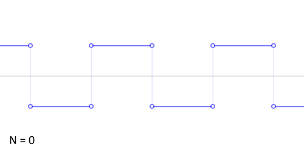

[↩️ صفحه اصلی](/README.md)

# 📡 سیگنال‌ها و سیستم‌ها

## 📊 اطلاعات کلی درس

| کد درس | واحد | نوع درس | پیش‌نیاز |
|:------:|:----:|:-------:|:--------:|
| 7777206 |  3   | اصلی   | ریاضی مهندسی |

## 🎯 اهداف درس
در این درس، دانشجویان با مفاهیم اساسی سیگنال‌ها و سیستم‌ها آشنا می‌شوند. این شامل تحلیل سیگنال‌ها در حوزه‌های زمان و فرکانس، بررسی سیستم‌های خطی و تغییرناپذیر در زمان، و آشنایی با تبدیلات مهم مانند فوریه و لاپلاس است.

## 👨‍🏫 مدرس
در سال‌های اخیر، اساتید متفاوتی این درس را ارائه کرده‌اند و مدرس ثابتی برای آن تعیین نشده است.

## 📚 منابع درس
- **Signals and Systems**
  - نویسندگان: A.V. Openheim, A.S. Willsky, S.H. Nawab
  - [دانلود](https://matlabkar.com/signals-and-systems-book-pdf/)

## 📅 سرفصل‌های درس

    <table>
        <tr>
            <th>شماره فصل</th>
            <th>عنوان</th>
        </tr>
        <tr>
            <td>1</td>
            <td>تعریف سیگنال‌ها</td>
        </tr>
        <tr>
            <td>2</td>
            <td>تعاریف مربوط به سیستم</td>
        </tr>
        <tr>
            <td>3</td>
            <td>بررسی سیستم‌های خطی و تغییرناپذیر در طول زمان</td>
        </tr>
        <tr>
            <td>4</td>
            <td>بیان سری فوریه پیوسته</td>
        </tr>
        <tr>
            <td>5</td>
            <td>سری فوریه گسسته</td>
        </tr>
        <tr>
            <td>6</td>
            <td>تبدیل فوریه سیگنال پیوسته</td>
        </tr>
        <tr>
            <td>7</td>
            <td>تبدیل فوریه گسسته</td>
        </tr>
        <tr>
            <td>8</td>
            <td>تبدیل لاپلاس</td>
        </tr>
        <tr>
            <td>9</td>
            <td>تبدیل z</td>
        </tr>
        <tr>
            <td>10</td>
            <td>نمونه‌برداری</td>
        </tr>
    </table>

## 🔗 منابع مفید دیگر

### منابع فارسی
- [دوره آموزشی سیگنال و سیستم - دکتر شفیعیان (آپارات)](https://www.aparat.com/v/J8FmM)
- [درس سیگنال و سیستم - مکتب‌خونه](https://maktabkhooneh.org/course/%D8%B3%DB%8C%DA%AF%D9%86%D8%A7%D9%84-%D9%88-%D8%B3%D9%8A%D8%B3%D8%AA%D9%85-mk75/#chapter)
- [تحلیل سیگنال‌ها و سیستم‌ها - فرادرس](https://faradars.org/courses/fvssa9408-analysis-of-signals-and-systems)

### منابع انگلیسی
- [Signals and Systems - MIT OpenCourseWare](https://ocw.mit.edu/courses/6-003-signals-and-systems-fall-2011/) - دوره کامل از دانشگاه MIT با ویدیوها و مواد درسی
- [Signals and Systems - edX (MIT)](https://www.edx.org/course/signals-and-systems-2) - دوره آنلاین تعاملی از MIT
- [Digital Signal Processing - Coursera (EPFL)](https://www.coursera.org/learn/dsp) - دوره مرتبط که مفاهیم پیشرفته‌تر را پوشش می‌دهد

## 💡 نکات مهم

- این درس پایه‌ای برای بسیاری از دروس پیشرفته‌تر در زمینه‌های مخابرات، پردازش سیگنال و کنترل است.
- استفاده از زبان هایی مانند MATLAB یا Python برای شبیه‌سازی و تحلیل سیگنال‌ها توصیه می‌شود.
- ممکن است تمرین های برنامه نویسی به دانشجویان داده شود.

------

موفق باشید! 🎓